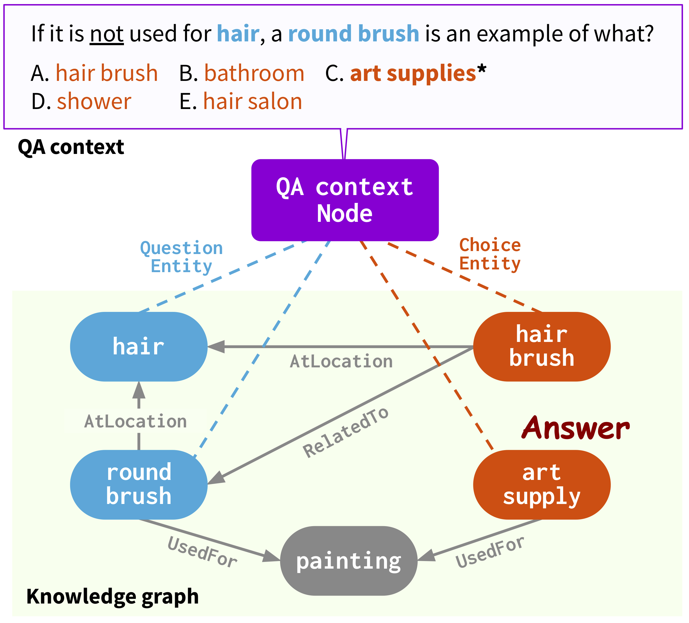
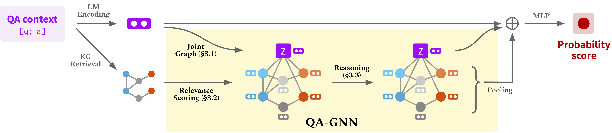

# QA-GNN: Question Answering using Language Models and Knowledge Graphs

This repo provides the source code & data of our paper: [QA-GNN: Reasoning with Language Models and Knowledge Graphs for Question Answering](https://arxiv.org/abs/2104.06378) (NAACL 2021).
```bib
@InProceedings{yasunaga2021qagnn,
  author =  {Michihiro Yasunaga and Hongyu Ren and Antoine Bosselut and Percy Liang and Jure Leskovec},
  title =   {QA-GNN: Reasoning with Language Models and Knowledge Graphs for Question Answering},
  year =    {2021},  
  booktitle = {North American Chapter of the Association for Computational Linguistics (NAACL)},  
}
```
Webpage: [https://snap.stanford.edu/qagnn](https://snap.stanford.edu/qagnn)
<p align="center">
  
</p>
<p align="center">
  
</p>


## Usage
### 0. Dependencies
Run the following commands to create a conda environment (assuming CUDA10.1):
```bash
conda create -n qagnn python=3.7
source activate qagnn
pip install torch==1.8.0+cu101 -f https://download.pytorch.org/whl/torch_stable.html
pip install transformers==3.4.0
pip install nltk spacy==2.1.6
python -m spacy download en

# for torch-geometric
pip install torch-scatter==2.0.7 -f https://pytorch-geometric.com/whl/torch-1.8.0+cu101.html
pip install torch-sparse==0.6.9 -f https://pytorch-geometric.com/whl/torch-1.8.0+cu101.html
pip install torch-geometric==1.7.0 -f https://pytorch-geometric.com/whl/torch-1.8.0+cu101.html
```


### 1. Download data
We use the question answering datasets (*CommonsenseQA*, *OpenBookQA*) and the ConceptNet knowledge graph.
Download all the raw data by
```
./download_raw_data.sh
```

Preprocess the raw data by running
```
python preprocess.py -p <num_processes>
```
The script will:
* Setup ConceptNet (e.g., extract English relations from ConceptNet, merge the original 42 relation types into 17 types)
* Convert the QA datasets into .jsonl files (e.g., stored in `data/csqa/statement/`)
* Identify all mentioned concepts in the questions and answers
* Extract subgraphs for each q-a pair

**TL;DR (Skip above steps and just get preprocessed data)**. The preprocessing may take long. For your convenience, you can download all the processed data by
```
./download_preprocessed_data.sh
```

**🔴 NEWS (Add MedQA-USMLE)**. Besides the commonsense QA datasets (*CommonsenseQA*, *OpenBookQA*) with the ConceptNet knowledge graph, we added a biomedical QA dataset ([*MedQA-USMLE*](https://github.com/jind11/MedQA)) with a biomedical knowledge graph based on Disease Database and DrugBank. You can download all the data for this from [**[here]**](https://nlp.stanford.edu/projects/myasu/QAGNN/data_preprocessed_biomed.zip). Unzip it and put the `medqa_usmle` and `ddb` folders inside the `data/` directory. While this data is already preprocessed, we also provide the preprocessing scripts we used in `utils_biomed/`.


The resulting file structure will look like:

```plain
.
├── README.md
├── data/
    ├── cpnet/                 (prerocessed ConceptNet)
    ├── csqa/
        ├── train_rand_split.jsonl
        ├── dev_rand_split.jsonl
        ├── test_rand_split_no_answers.jsonl
        ├── statement/             (converted statements)
        ├── grounded/              (grounded entities)
        ├── graphs/                (extracted subgraphs)
        ├── ...
    ├── obqa/
    ├── medqa_usmle/
    └── ddb/
```

### 2. Train QA-GNN
For CommonsenseQA, run
```
./run_qagnn__csqa.sh
```
For OpenBookQA, run
```
./run_qagnn__obqa.sh
```
For MedQA-USMLE, run
```
./run_qagnn__medqa_usmle.sh
```
As configured in these scripts, the model needs two types of input files
* `--{train,dev,test}_statements`: preprocessed question statements in jsonl format. This is mainly loaded by `load_input_tensors` function in `utils/data_utils.py`.
* `--{train,dev,test}_adj`: information of the KG subgraph extracted for each question. This is mainly loaded by `load_sparse_adj_data_with_contextnode` function in `utils/data_utils.py`.

**Note**: We find that training for OpenBookQA is unstable (e.g. best dev accuracy varies when using different seeds, different versions of the transformers / torch-geometric libraries, etc.), likely because the dataset is small. We suggest trying out different seeds. Another potential way to stabilize training is to initialize the model with one of the successful checkpoints provided below, e.g. by adding an argument `--load_model_path obqa_model.pt`.


### 3. Evaluate trained model
For CommonsenseQA, run
```
./eval_qagnn__csqa.sh
```
Similarly, for other datasets (OpenBookQA, MedQA-USMLE), run `./eval_qagnn__obqa.sh` and `./eval_qagnn__medqa_usmle.sh`.
You can download trained model checkpoints in the next section.


## Trained model examples
CommonsenseQA
<table>
  <tr>
    <th>Trained model</th>
    <th>In-house Dev acc.</th>
    <th>In-house Test acc.</th>
  </tr>
  <tr>
    <th>RoBERTa-large + QA-GNN <a href="https://nlp.stanford.edu/projects/myasu/QAGNN/models/csqa_model_hf3.4.0.pt">[link]</a></th>
    <th>0.7707</th>
    <th>0.7405</th>
  </tr>
</table>

OpenBookQA
<table>
  <tr>
    <th>Trained model</th>
    <th>Dev acc.</th>
    <th>Test acc.</th>
  </tr>
  <tr>
    <th>RoBERTa-large + QA-GNN <a href="https://nlp.stanford.edu/projects/myasu/QAGNN/models/obqa_model_hf3.4.0.pt">[link]</a></th>
    <th>0.6960</th>
    <th>0.6900</th>
  </tr>
</table>

MedQA-USMLE
<table>
  <tr>
    <th>Trained model</th>
    <th>Dev acc.</th>
    <th>Test acc.</th>
  </tr>
  <tr>
    <th>SapBERT-base + QA-GNN <a href="https://nlp.stanford.edu/projects/myasu/QAGNN/models/medqa_usmle_model_hf3.4.0.pt">[link]</a></th>
    <th>0.3789</th>
    <th>0.3810</th>
  </tr>
</table>

**Note**: The models were trained and tested with HuggingFace transformers==3.4.0.


## Use your own dataset
- Convert your dataset to  `{train,dev,test}.statement.jsonl` in .jsonl format (see `data/csqa/statement/train.statement.jsonl`)
- Create a directory in `data/{yourdataset}/` to store the .jsonl files
- Modify `preprocess.py` and perform subgraph extraction for your data
- Modify `utils/parser_utils.py` to support your own dataset


## Acknowledgment
This repo is built upon the following work:
```
Scalable Multi-Hop Relational Reasoning for Knowledge-Aware Question Answering. Yanlin Feng*, Xinyue Chen*, Bill Yuchen Lin, Peifeng Wang, Jun Yan and Xiang Ren. EMNLP 2020.
https://github.com/INK-USC/MHGRN
```
Many thanks to the authors and developers!
